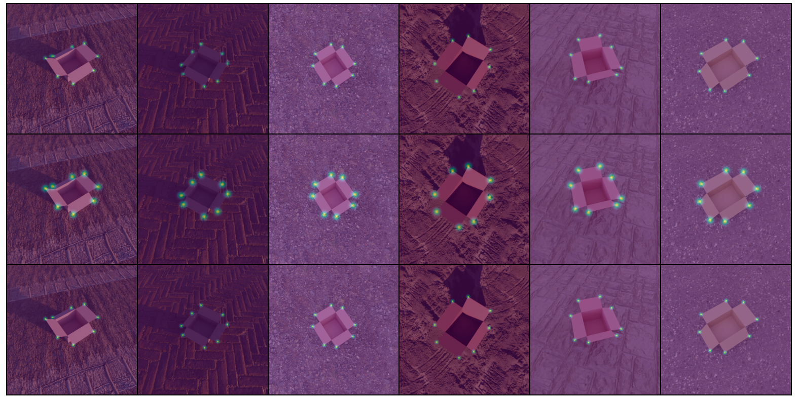
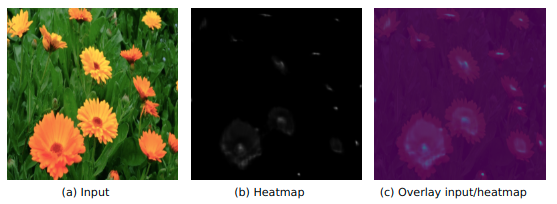

<h1 align="center">Pytorch Keypoint Detection</h1>

A Framework for keypoint detection using [Pytorch Lightning](https://pytorch-lightning.readthedocs.io/en/latest/) and [wandb](https://docs.wandb.ai/). Keypoints are trained with Gaussian Heatmaps, as in [Jakab et Al.](https://proceedings.neurips.cc/paper/2018/hash/1f36c15d6a3d18d52e8d493bc8187cb9-Abstract.html) or [Centernet](https://github.com/xingyizhou/CenterNet).

This package is been used for research at the [AI and Robotics](https://airo.ugent.be/projects/computervision/) research group at Ghent University. You can see some applications below: The first image shows how this package is used to detect corners of cardboard boxes, in order to close the box with a robot. The second example shows how it is used to detect a varying number of flowers.
<div align="center">
  
  
</div>


## Main Features
- The detector can deal with an **arbitrary number of keypoint channels**, that can contain **a varying amount of keypoints**. You can easily configure which keypoint types from the COCO dataset should be mapped onto the different channels of the keypoint detector. This flexibility allows to e.g. combine different semantic locations that have symmetries onto the same channel to overcome this ambiguity.
- We use the standard **COCO dataset format**.

-  **different backbones** can be used (Unet-like, dilated CNN, Unet-like with pretrained encoders). Furthermore you can  easily add new backbones or loss functions. The head of the keypoint detector is a single CNN layer.

- The package contains an implementation of the Average Precision metric for keypoint detection. The threshold distance for classification of detections as FP or TP is based on L2 distance between the keypoints and ground truth keypoints.
- Extensive **logging to wandb is provided**: The train/val loss for each channel is logged, together with the AP metrics for all specified treshold distances and all channels.  Furthermore, the raw heatmaps, detected keypoints and ground truth heatmaps are logged to provide insight in the training dynamics and to verify all data processing is as desired.
- All **hyperparameters are configurable** using a python argumentparser or wandb sweeps.

note: this package is still under development and we make no commitment on backwards compatibility nor reproducibility on the main branch. If you need this, it is best to pin a single commit.


TODO: add integration example.

## Local Installation
- clone this repo in your project (e.g. as a [submodule](https://git-scm.com/book/en/v2/Git-Tools-Submodules), using [vcs](https://github.com/dirk-thomas/vcstool),..). It is recommended to lock to the current commit as there are no guarantees w.r.t. backwards comptability.
- create a conda environment using `conda env create --file environment.yaml`
- activate with `conda activate keypoint-detection`
- run `wandb login` to set up your wandb account.
- you are now ready to start training.


## Training

To train a keypoint detector,  run the `keypoint-detection train` CLI with the appropriate arguments.
To create your own configuration: run `keypoint-detection train -h` to see all parameter options and their documentation.

A good starting point could be the bash script `bash test/integration_test.sh` to test on the provided test dataset, which contains 4 images. You should see the loss going down consistently until the detector has completely overfit the train set and the loss is around the entropy of the ground truth heatmaps (if you selected the default BCE loss).

### Wandb sweeps
Alternatively, you can create a sweep on [wandb](https://wandb.ai) and to then start a (number of) wandb agent(s). This is very useful for running multiple configurations (hparam search, testing on multiple datasets,..)

### Loading pretrained weights
If you want to load pretrained keypoint detector weights, you can specify the wandb artifact of the checkpoint in the training parameters: `keypoint-detection train ..... -wandb_checkpoint_artifact <artifact-path>`. This can be used for example to finetune on real data after pretraining on synthetic data.

## Dataset

This package used the [COCO format](https://cocodataset.org/#format-data) for keypoint annotation and expects a dataset with the following structure:
```
dataset/
  images/
    ...
  <name>.json : a COCO-formatted keypoint annotation file with filepaths relative to its parent directory.
```
For an example, see the `test_dataset` at `test/test_dataset`.


### Labeling
If you want to label data, we use[CVAT](https://github.com/opencv/cvat) labeling tool. The flow and the code to create COCO keypoints datasets is all available in the [airo-dataset-tools](https://github.com/airo-ugent/airo-mono/tree/main) package.

It is best to label your data with floats that represent the subpixel location of the keypoints. This allows for more precise resizing of the images later on. The keypoint detector cast them to ints before training to obtain the pixel they belong to (it does not support sub-pixel detections).

## Evaluation
TODO
`keypoint-detection eval --help`

## Fiftyone viewer
TODO
`scripts/fiftyone_viewer`

## Using a trained model for  Inference
During training Pytorch Lightning will have saved checkpoints. See `scripts/checkpoint_inference.py` for a simple example to run inference with a checkpoint.
For benchmarking the inference (or training), see `scripts/benchmark.py`.


## Metrics

TO calculate AP, precision or recall, the detections need to be classified into False Positives and False negatives as for object detection or instance segmentation.

This package simply uses a number of euclidian pixel distance thresholds. You can set the euclidian distances for which you want to calculate the metrics in the hyperparameters.

Pixel perfect keypoints have a pixel distance of 0, so if you want a metric for pixel-perfect keypoints you should add a threshold distance of 0.

Usually it is best to calculate the real-world deviations (in cm) that are acceptable and then determine the threshold(s) (in pixels) you are interested in.

In general a lower threshold will result in a lower metric. The size of this gap is determined by the 'ambiguity' of your dataset and/or the accuracy of your labels.

#TODO: add a figure to illustrate this.


We do not use OKS as in COCO for the following reasons:
1. it requires bbox annotations, which are not always required for keypoint detection itself and represent additional label effort.
2. More importantly, in robotics the size of an object does not always correlate with the required precision. If a large and a small mug stand on a table, they require the same precise localisation of keypoints for a robot to grasp them even though their apparent size is different.
3. (you need to estimate label variance, though you could simply set k=1 and skip this part)


## Development  info
- formatting and linting is done using [pre-commit](https://pre-commit.com/)
- testing is done using pytest (with github actions for CI)


## Note on performance
- Keep in mind that calculating the Average Precision is expensive operation, it can easily take as long to calculate the AP of a .1 data split as it takes to train on the remaining 90% of the data. Therefore it makes sense to use the metric sparsely, for which hyperparameters are available. The AP will always be calculated at the final epoch.

## Note on top-down vs. bottom-up keypoint detection.
There are 2 ways to do keypoint detection when multiple instances are present in an image:
1. first do instance detection and then detect keypoints on a crop of the bbox for each instance
2. detect keypoints on the full image.

Option 1 suffers from compounding errors (if the instance is not detected, no keypoints will be detected) and/or requires you to train (and hence label) an object detector.
Option 2 can have lower performance for the keypoints (more 'noise' in the image that can distract the detector) and if you have multiple keypoints / instance as well as multiple instances per image, you need to do keypoint association.

This repo is somewhat agnostic to that choice.
For 1: crop your dataset upfront and train the detector on those crops, at inference: chain the object detector and the keypoint detector.
for 2: If you can do the association manually, simply do it after inference. However this repo does not offer learning the associations as in the [Part Affinity Fields]() paper.


## Rationale:
TODO
- why this repo?
  - why not label keypoints as bboxes and use YOLO/Detectron2?
  - ..

# Citing this project

You are invited to cite the following publication if you use this keypoint detector in your research:
```
@inproceedings{lips2022synthkeypoints,
  title={Learning Keypoints from Synthetic Data for Robotic Cloth Folding},
  author={Lips, Thomas and De Gusseme, Victor-Louis and others},
  journal={2nd workshop on Representing and Manipulating Deformable Objects - ICRA},
  year={2022}
}
```
