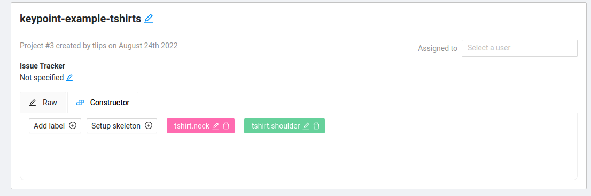

# CVAT to COCO Keypoints

This readme defines a workflow to label semantic keypoints on images using [CVAT](https://www.cvat.ai/) and to convert them to the [COCO keypoints format](https://cocodataset.org/#format-data).
 This package contains parsers for the different dataset formats and code to convert from the CVAT Image 1.1 format to COCO format.


## Labeling use case analysis
- **we want to label semantic keypoints on images**.
- There can be **multiple categories / classes of objects in the images**. Each category can have 0 - N instances in each image. (think about categories/classes as objects that you could draw a bounding box or segmentation mask for).
- Each category has a number of  **semantic types** of keypoints that are of interest. E.g. arms, shoulders, head,.. for the person category.
- Each semantic type can contain multiple keypoints (e.g. a human has 2 shoulders, a cardboard box has 4 corners). Although you could label these separately (and for humans this is very natural as humans have a front/back side, unlike boxes for which there is no semantic difference between the corners), this creates a burden as you have to do this in a geometrically consistent way by e.g. always labeling most topleft corner of a box as 'corner1'. This is easily done afterwards using e.g. the quadrant of each corner and asking the labeler to do so only leads to more work and possible inaccuracies. Therefore each semantic type can have 0 - K keypoints.

**So each image has N_i instances of each of the K categories and each instance has the M semantic types of that category, where each each type has S_i keypoints.**

We hence need to be able to
- group the keypoints of a single instance of a category together
- and to label multiple keypoints under one semantic type and later separate them for the COCO format (which does not allow for multiple keypoints for a single type).


## CVAT configuration
In CVAT we create a **label** for each **semantic type** of each **category** using the naming convention **{category}.{semantic_type}**. You then label all keypoints of a single type in the image. If there are multiple instances of a single category, you group them together using the Grouping Tool in CVAT, if there is only one instance of a category, there is no need to manually group them together.

After labeling, the annotations XML can be downloaded.

## Converting CVAT to COCO
- clone this repo and pip install the requirements of this package.
- [set up CVAT](docs/cvat_setup.md)
- create a task and define your labels.
- label your images.
- export the annotations XML in the CVAT images format.
- create a Category configuration that specifies for each category:
    - it's name
    - it's desired ID
    - it's supercategory
    - it's semantic types and how much keypoints each type has

    This configuration is then used to create the COCO object categories and define all the keypoints for each categorie.

- then, from this readme's folder,  run `python convert_cvat_to_coco.py --cvat_xml_file example/annotations.xml --coco_categories_config_path example/coco_category_configuration.json` to create a `coco.json` annotation file. You should now have a COCO dataset annotation file, that you can use for example with

## Example
There is an example included for 4 images containing a number of tshirts.
The desired categories configuration is as follows (see `examples/coco_category_configuration.json`)
```
{
    "categories": [
        {
            "name": "tshirt",
            "supercategory": "cloth",
            "id": 23,
            "semantic_types": [
                {
                    "name": "neck",
                    "n_keypoints": 1
                },
                {
                    "name": "shoulder",
                    "n_keypoints": 2
                }
            ]
        }
    ]
}
```

which implies we have 1 object class that has 2 semantic types: 'neck' with 1 keypoint and 'shoulder' with 2 keypoints (left/right, which is an artificial example as a tshirt has a front and back side and hence there is no ambiguity)

To label this configuration, we create 2 labels in cvat:
.


One image contains 2 instances of the tshirt, which should hence be grouped using CVATs group_id. One image is not labeled to show this can be dealt with. Another image is partially labeled to simulate partial visibility.
You can find the resulting CVAT annotations in `example/annotations.xml`.

You can now finally convert the CVAT annotations to COCO annotation format, which results in the `example/coco.json` file.
